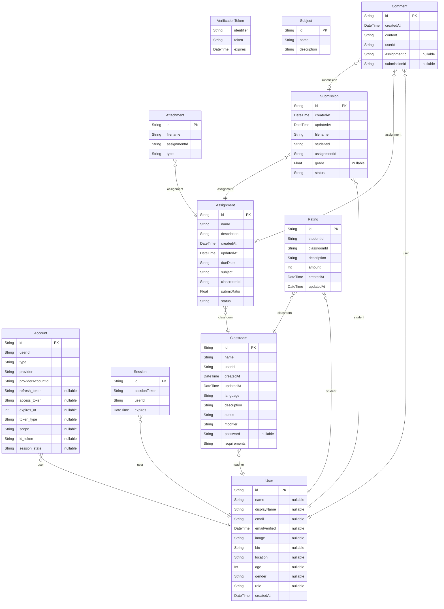

```mermaid
erDiagram

  Account {
    String id PK 
    String userId  
    String type  
    String provider  
    String providerAccountId  
    String refresh_token  "nullable"
    String access_token  "nullable"
    Int expires_at  "nullable"
    String token_type  "nullable"
    String scope  "nullable"
    String id_token  "nullable"
    String session_state  "nullable"
    }
  

  Session {
    String id PK 
    String sessionToken  
    String userId  
    DateTime expires  
    }
  

  User {
    String id PK 
    String name  "nullable"
    String displayName  "nullable"
    String email  "nullable"
    DateTime emailVerified  "nullable"
    String image  "nullable"
    String bio  "nullable"
    String location  "nullable"
    Int age  "nullable"
    String gender  "nullable"
    String role  "nullable"
    DateTime createdAt  
    }
  

  VerificationToken {
    String identifier  
    String token  
    DateTime expires  
    }
  

  Classroom {
    String id PK 
    String name  
    String userId  
    DateTime createdAt  
    DateTime updatedAt  
    String language  
    String description  
    String status  
    String modifier  
    String password  "nullable"
    String requirements  
    }
  

  Subject {
    String id PK 
    String name  
    String description  
    }
  

  Attachment {
    String id PK 
    String filename  
    String assignmentId  
    String type  
    }
  

  Assignment {
    String id PK 
    String name  
    String description  
    DateTime createdAt  
    DateTime updatedAt  
    String dueDate  
    String subject  
    String classroomId  
    Float submitRatio  
    String status  
    }
  

  Submission {
    String id PK 
    DateTime createdAt  
    DateTime updatedAt  
    String filename  
    String studentId  
    String assignmentId  
    Float grade  "nullable"
    String status  
    }
  

  Comment {
    String id PK 
    DateTime createdAt  
    String content  
    String userId  
    String assignmentId  "nullable"
    String submissionId  "nullable"
    }
  

  Rating {
    String id PK 
    String studentId  
    String classroomId  
    String description  
    Int amount  
    DateTime createdAt  
    DateTime updatedAt  
    }
  
    Account o{--|| User : "user"
    Session o{--|| User : "user"
    Classroom o{--|| User : "teacher"
    Attachment o{--|| Assignment : "assignment"
    Assignment o{--|| Classroom : "classroom"
    Submission o{--|| User : "student"
    Submission o{--|| Assignment : "assignment"
    Comment o{--|| User : "user"
    Comment o{--|o Assignment : "assignment"
    Comment o{--|o Submission : "submission"
    Rating o{--|| User : "student"
    Rating o{--|| Classroom : "classroom"
```
